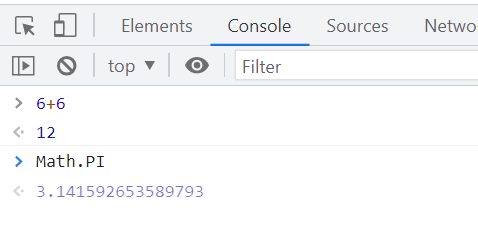

# 02-01 자바스크립트란?
Netscape Communiction이 개발한 브라우저 전용의 스크립트 언어로 개발 당시에는 LiveScript라 불리었지만 그당시 유행하던 java와 흡사하여 나주에 javascipt로 개명되었다. 
자바스크립트란 개발자가 만든 문서에 방문자가 방문하여 어떤 동작을 취했을 때, 그 동작에 대응하여 반응이 일어날 수 있도록 해주는 언어이다. 즉, 우리가 흔히 보는 GNB(Global Navigation Bar) 요소에 마우스를 올리면 그에 해당하는 서브메뉴가 펼쳐지는 것과 같다.
자바스크립트는 프런트엔드와 백엔드 모두에서 구분없이 사용할 수 있다. 
node.js 는 자바스크립트의 기본 문법을 대부분 응용할 수 있다. 

# 02-02 자바스크립트 언어의 특징
1. 자바스크립트는 인터프린터 언어이다.
자바스크립트는 코드가 작성된 순서대로 윗줄부터 순서대로 구문을 분석한다.
1. 자바스크립트는 클라이언트 스크립트 언어이다.
자바스크립트는 서버(서비스를 제공하는 컴퓨터)에서 실행되는 것이 아니라, 사용자 컴퓨터의 브라우저에서 실행된다. 때문에 서버의 부하를 줄일 수 있다.
1. 객체 기반 언어이다.
자바스크립트는 객체를 기반으로 한 언어이다. 따라서 다양한 객체가 존재하며, 그에 해당하는 다양한 기능(메서드)들이 존재한다.
1. 공개된 언어이다.
웹문서에 완성된 스크립트는 외부로 분리할 수는 있으나 완벽시 숨길수는 없다.
1. 다양한 라이브러리를 활용할 수 있다.
자바스크립트이 대표적인 라이브러리 언어는 제이쿼리이다.
라이브러리란 자바스크립트를 이용하여 다양한 기능들을 쉽게 구현할 수 있도록 한 함수들이 집합이다. 이외에도 자바스크립트 언어는 현재 ~~
1.  Dynamic Typing 스타일의 언어 

# 02-03 자바스크립트 코드 작성시 주의점
1. 자바스크립트는 대소문자를 엄밀히 구분하여 사용한다.
1. 실행문을 맨 끝에 세미콜론(;)을 붙인다. 세미콜론을 생략하는 것도 가능하지만 문장의 단락이 불명확해지므로 생략하지 않는 것을 추천하다. 
1. 문자형 데이터를 작성할 때는 큰따옴표(“”)와 작은 따옴표(‘’) 겹침 오류를 주의한다.
1. 실행문을 작성할 때 중괄호｛｝또는 소괄호() 의 짝이 맞추어 사용한다.
1. 실행문을 작성할 때는 한 줄에 한 문장씩 작성하는 것이 가독성을 높여 준다. 하나의 문장이 긴 경우 문장 도중에 적절한 개행이나 인덴트를 넣을 수 있다. 

```
window.
       alert
            (“Hello javascript!!”);
```
 
# 02-04 자바스크립트 기능
1. 자바스크립트는 웹브라우저에서 동작하는 프로그램밍 언어
2. html, css와 함께 동적 웹페이지 구성요소
3. 문자, 숫자, 배열 등의 데이터를 다룬다. 
4. 날짜와 시간을 다룬다. 
5. 브라우저를 조작한다. 
6. 이벤트를 처리한다. 
7. 페이지의 데이터 요소를 조작한다. 
8. 폼을 조작한다. 
9. 애니메이션 효과를 처리한다. 
10. 이미지/ 사운드 / 영상을 다룬다. 
11. 데이터를 송수신한다. 
12. 로컬 데이터를 다룬다. 


# 브라우저에서 자바스크립트 실행하기
# 자바스크립트 실행환경1
```
<!doctype html>
<html lang="ko">
<head>
  <meta charset="UTF-8">
  <title></title>
  <link rel="stylesheet" href="style.css"/>
  <script>
    alert('안녕하세요!');
  </script>
</head>
<body></body>
</html>
```
# 자바스크립트 실행환경2
```
// test01.html
<!doctype html>
<html lang="ko">
<head>
  <meta charset="UTF-8">
  <title></title>
  <link rel="stylesheet" href="style.css"/>
  <!-- main.js 불러오기 -->
  <script src="main.js" defer></script>
</head>
<body></body>
</html>
```
```
// main.js
alert('반가워요!');
```


1. 브라우저를 이용한 출력 

```
<!DOCTYPE html>
<html lang="kr">
  <head>
    <meta charset="UTF-8" />
    <meta http-equiv="X-UA-Compatible" content="IE=edge" />
    <meta name="viewport" content="width=device-width, initial-scale=1.0" />
    <title>Document</title>
    <script src="main.js"></script>
  </head>
  <body>
    <script>
      console.log("Me too, javascript!!");
    </script>
  </body>
</html>
```

javascript를 head에 두었을 때는 javascript를 fetching하는 동안 blocking되어 웹사이트 로드가 느려질 수 있고 body 끝에 두었을때는 html, css를 로딩한 후 javascript를 fetching 하니  javascript에 의존적이지 않은 경우만 빨리 실행,  javascript에 의존적인 경우 blocking 되고 실행도 느려져 더욱 느려질 수도 있다.
 
```
<script asyn src="main.js"></script>
```
asyn 는 bloolean 값으로 parsing 과 fetching을 병렬처리하므로 body 끝에 두었을 때보다는 실행이 빠를 순 있으나 dom 요소를 사용할 경우 여전히 위험할 수 있다. 또한 javascript가 모두 다운로드 되면 언제든지 parsing을 멈추고 javascript를 실행하기 때문에 여전히 blocking 시간이 발생한다. 

```
<script defer src="main.js"></script>
```
defer 는 bloolean 값으로 병렬처리로 parsing과 fatching을 같이 하는 것은 asyn와 비슷하나 javascript를 모두 다운되어도 blocking되지 않고 여전히 parsing을 하고 parsing이 완료되면 실행한다. 

# node.js를 이용한 자바스크립트 실행
# 자바스크립트 실행환경2

[javascript 공식 사이트 ecma](https://www.ecma-international.org/)

[javascript 공식 사이트 mozilla](https://developer.mozilla.org/ko/)

https://www.w3schools.com/ 
공식 사이트는 아니고 노르웨이에서 만든 사이트이나 시대를 반영하고 있음 

1. node.js 설치  (npm도 같이 설치됨)
    - javascript 엔진이 있어서 브라우저 없이도 자바스크립트가 실행됨 
    - url : https://nodejs.org/ko/ LTS버전으로 다운로드
    - nodejs를 다른 위치에 설치할게 아니라면 그냥 다 next

2. 설치 완료 후 확인
    - window키 => cmd 엔터
    - nodejs 버전 확인 명령어 : node -v
    - npm 버전 확인 명령어 : npm -v
    - 해당명령어가 없다고 나올경우 classpath가 틀렸꺼나 nodejs설치가 안된 경우라서
    classpath를 잡아주면 좋은데 힘드시니까 그냥 다시 설치하면 됩니다.
    - 다시 설치하면 자동으로 잡아줍니다.(새로 설치된 곳으로)

3. “Hello javaScript” 출력하기 ( 터미널 창에서 node를 이용한 javascript 실행)

```
“main.js” 파일 생성 만들고 다음과 같이 저장
console.log(“Hello javaScript”);  

- git bash > $ node main.js 실행 
```

# 자바스크립트 실행
1. Node.js REPL
    - 터미널 창에서 후 > 바뀌면  자바스크립트 실행
    ```
    $ node
    Welcome to Node.js v16.13.0.
    Type ".help" for more information.
    > 1 +2
    3
    > Math.max( 1, 2, 45)
    45
    >
    
    ```
    - 다음과 같이 개발툴 > 콘솔 탭에서 직접 javascript를 실행할 수도 있다. 
콘솔 탭에서는 javascript를 동적으로 검사하고 간단히 실행하는 등 편리하게 사용할 수 있다. 

    


# console API 확인
## console API(Application Programming Interface) 확인

https://developer.mozilla.org/ko/

https://developer.mozilla.org/ko/docs/Web/API

https://nodejs.org/ko/

https://nodejs.org/dist/latest-v14.x/docs/api/console.html

## 개발툴 사용

console 탭 : 

source 탭 : 디버깅 가능

network


## 여러 브라우저 콘솔 패널 표시 
- MS Edge
  ...(메뉴바) >기타도구 > [개발자도구] == F12 

- google Chrome
  ...(메뉴바) >도구더보기 > [개발자도구] == F12 
  
- Mozilla Firefox
  ...(메뉴바) > [웹개발자도구] > [웹콘솔] 
 
- mac Safari
  ...(메뉴바) > safari > [환경설정] > [고급]  > [메뉴 바에서 개발자용 메뉴 보기] 체크
  메뉴바에서 [개발자용] > [javascript 콘솔표시] 선택
 
# example 다양한 방법으로 확인하기
```
const a = 10;
const b = 20;
const sum = a + b;
console.log(sum); // 결과값： 30
````
    
# 여러개 파라미터 확인하기 
```
console.log('안녕하세요.', '지금은', new Date(), '입니다.');
```