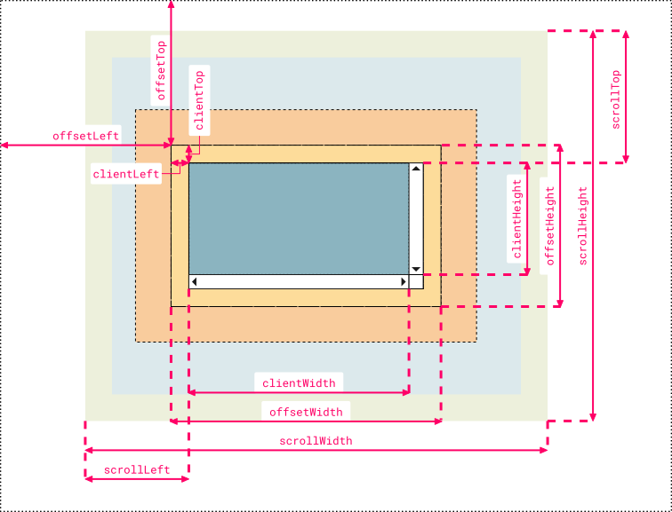

# 이벤트 처리 
- 브라우저는 처리해야 할 특정 사건이 발생하면 이를 감지하고 이벤트를 발생시킨다. 
- 클릭, 탭, 스크롤, 화면 불러오기, JSON 읽어 오기등 다양한 이벤트 존재 
- 이벤트가 발생했을 때 호출될 함수를 이벤트 핸들러
- 이벤트가 발생했을 때 브라우저에게 이벤트 핸들러의 호출을 위임하는 것을 이벤트 핸들러 등록이라 한다. 
- 이와 같이 프로그램 흐름을 이벤트 중심으로 제어하는 것을 이벤트 드리븐 프로그래밍이라 한다. 
- 즉 유저 조작에 따라 작업을 처리하고 싶을 때 이벤트를 핸들러를 사용하여 어플리케이션과 상호작용 할 수 있다. 


# 이벤트 종류 
[https://developer.mozilla.org/ko/docs/Web/API/Event] https://developer.mozilla.org/ko/docs/Web/API/Event

## 마우스 이벤트 
|이벤트 타입| 이벤트 발생 시점|
|---|---|
|click| 마우스 버튼을 클릭했을 때 |
|dblclick| 마우스 버튼을 더블클릭했을 때 |
|mousedown| 마우스 버튼을 눌렀을 때 |
|mouseup| 누르고 있던 마우스 버튼을 놓았을 때  |
|mousemove| 마우스커서를 움직였을 때  |
|mouseenter| 마우스커서를 HTML 요소 **안**으로 이동했을 때(**버블링되지 않음**) |
|mouseover| 마우스커서를 HTML 요소 **안**으로 이동했을 때(**버블링됨**)  |
|mouseleave| 마우스커서를 HTML 요소 **밖**으로 이동했을 때(**버블링되지 않음**)  |
|mouseout| 마우스커서를 HTML 요소 **밖**으로 이동했을 때(**버블링됨**)  |

## 키보드 이벤트 
|이벤트 타입| 이벤트 발생 시점|
|---|---|
|keydown| **모든 키**를 누렀을 때 발생 , 문자, 숫자, 특수문자, enter키를 눌렀을 때 연속 발생 |
|keypress| **문자** 키를 누렀을 때 발생 , 문자, 숫자, 특수문자, enter키를 눌렀을 때 연속 발생, 폐지됨 |
|keyup| 누르고 있던 키를 놓았을 때 한 번만 발생|

## 포커스 이벤트 
|이벤트 타입| 이벤트 발생 시점|
|---|---|
|focus| HTML 요소가 포커스를 받았을 때(**버블링 되지 않음**)|
|blur| HTML 요소가 포커스를 잃었을 때(**버블링 되지 않음**)|
|focusin| HTML 요소가 포커스를 받았을 때(**버블링 됨**)|
|blurout| HTML 요소가 포커스를 잃었을 때(**버블링 됨**)|

## 값 변경 이벤트 
|이벤트 타입| 이벤트 발생 시점|
|---|---|
|input| input(text, checkbox, radio), select, textarea 요소의 값이 **입력**되었을 때|
|change| input(text, checkbox, radio), select, textarea 요소의 값이 ***변경***되었을 때|
|readystatechange| HTML 문서의 로드와 파싱 상태를 나타내는 document.readyState 프로퍼티 값('loading','interactive', 'complete')이 변경될 때|

- 사용자가 입력을 하고 있을때는 input 이벤트가 발생하고 사용자가 입력을 종료하여 값이 변경되면 change 이벤트가 발생한다. 

## DOM 뮤테이션 이벤트 
|이벤트 타입| 이벤트 발생 시점|
|---|---|
|DOMcontentLoaded| HTML 문서의 로드와 파싱이 완료되어 DOM 생성이 완료되었을 때 |

## 뷰 이벤트 
|이벤트 타입| 이벤트 발생 시점|
|---|---|
|resize| 브라우저 윈도우 크기를 변경할 때 연속적으로 발생, 오직 window 객체에서만 발생|
|scroll| document(웹페이지) 또는 html 요소를 스크롤할때  연속적으로 발생|

## 리소스 이벤트 
|이벤트 타입| 이벤트 발생 시점|
|---|---|
|load| DOMcontentLoaded 이벤트가 발생한 이후 , 모든 리소의 로딩이 완료되었을 때 발생|
|unload| 리소스가 언로드 될때 (주로 새로운 웹페이지를 요청한 경우 )|
|abort| 리소스 로딩이 중단되었을 때 |
|error| 리소스 로딩이 실패했을 때 |


# 주요 이벤트 핸들러 사용
1. 어트리뷰트 방식 : 태그 내의 속성으로 선언하기
2. 프로퍼티 방식 : 요소 객체의 프로퍼티로 선언하기 
3. adddEventListener 메소드로 선언하기


.addClass()
.setAttribute('class', '클래스')
.classList.add('클래스')

.removeClass()
.classList.remove()
.classList.toggle()

브라우저의 capture flow 순서는 바꿀수 없으나
copture와 bubble은 선택할 수 있다. 


Propagation Up = capture
.stopPropagation()

html에서 이벤트 실행시 bubble실행이라면 모두 실행이 안될 수 있음 


이벤트에 공통적으로 들어가는 메소드도 있고 속성도 있음 
currentTarget, target은 공통 속성

a를 클릭하면 다른 페이지로 이동한다
checkbox 클릭시 
는 기본 로직
기본 로직을 변경하고 싶을 때 preventDefault()

# 40-01 어트리뷰트 방식
```html
<!DOCTYPE html>
<html>
<body>
  <button onclick="sayHi('Lee')">Click me!</button>
  <script>
    function sayHi(name) {
      console.log(`Hi! ${name}.`);
    }
  </script>
</body>
</html>
```
# 40-02
```html
<!DOCTYPE html>
<html>
<body>
  <button>Click me!</button>
  <script>
    const $button = document.querySelector('button');

    // 사용자가 버튼을 클릭하면 함수를 호출하도록 요청
    $button.onclick = function(){ alert('button click'); };
  </script>
  <script>
    const $button = document.querySelector('button');

    // 화살표함수로 표현
    $button.onclick = () => { alert('button click'); };
  </script>
</body>
</html>
```

# 40-03

```javascript
function onclick(event) {
  sayHi('Lee');
}
```


```event 정보 출력 
function onclick(event) {
  console.log(event);
  console.log(event.target);
}
```


# 40-04

```html
<!-- 이벤트 핸들러에 인수를 전달하기 곤란하다. -->
<button onclick="sayHi">Click me!</button>
```

# 40-05

```html
<button onclick="console.log('Hi! '); console.log('Lee');">Click me!</button>
```

# 40-06

```html
<!-- Angular -->
<button (click)="handleClick($event)">Save</button>

{ /* React */ }
<button onClick={handleClick}>Save</button>

<!-- Svelte -->
<button on:click={handleClick}>Save</button>

<!-- Vue.js -->
<button v-on:click="handleClick($event)">Save</button>
```

# 40-07

```html
<!DOCTYPE html>
<html>
<body>
  <button>Click me!</button>
  <script>
    const $button = document.querySelector('button');

    // 이벤트 핸들러 프로퍼티에 이벤트 핸들러를 바인딩
    $button.onclick = function () {
      console.log('button click');
    };
  </script>
</body>
</html>
```

# 40-08

```html
<!DOCTYPE html>
<html>
<body>
  <button>Click me!</button>
  <script>
    const $button = document.querySelector('button');

    // 이벤트 핸들러 프로퍼티 방식은 하나의 이벤트에 하나의 이벤트 핸들러만을 바인딩할 수 있다.
    // 첫 번째로 바인딩된 이벤트 핸들러는 두 번째 바인딩된 이벤트 핸들러에 의해 재할당되어
    // 실행되지 않는다.
    $button.onclick = function () {
      console.log('Button clicked 1');
    };

    // 두 번째로 바인딩된 이벤트 핸들러
    $button.onclick = function () {
      console.log('Button clicked 2');
    };
  </script>
</body>
</html>
```

# 40-09 addEventListener 방식

```html
<!DOCTYPE html>
<html>
<body>
  <button>Click me!</button>
  <script>
    const $button = document.querySelector('button');

    // 이벤트 핸들러 프로퍼티 방식
    // $button.onclick = function () {
    //   console.log('button click');
    // };

    // addEventListener 메서드 방식
    $button.addEventListener('click', function () {
      // 함수를 직접 제작할 수도 있고 
      console.log('button click');
    });
  </script>
</body>
</html>
```


```html
<!DOCTYPE html>
<html>
<body>
  <button>Click me!</button>
  <script>
    const $button = document.querySelector('button');
    
    // 함수를 밖으로 뺄 수도 있고 
    // function onClickButton() {
    //   console.log('button click');
    // }

    // 다음과 같이 화살표 함수로 바꿀 수 있다. 
    // 변수처럼 사용되므로 addEventListener보다 상위에서 호출 되어야 한다. 
    const onClickButton = () => console.log('buttin click');

    // addEventListener 메서드 방식
    $button.addEventListener('click', onClickButton, option);

    // option 을 두어 capture, bubble을 설정할 수 있다. 
  </script>
</body>
</html>
```
# addEventListener 방식 
.addEventListener('click', onClickButton, option);
option은 반드시 설정할 필요는 업ㅅ고 생략하면 false

|옵션| 의미| 타입|
|---|---|
|capture| 이벤트 캡쳐 여부 | 논리값 |
|once| 리스너 1회 실행 여부| 논리값 |
|passive| 패시브 이벤트 여부 | 논리값 |

```
  <button class="button">Click me!</button>

  const option = { 
      once : true  // 한번만 실행하고 싶은 경우 
  }
  document.querySelector('.button')
          .addEventListener('click', onClickButton , option);

  function onClickButton(){
    alert('버튼 클릭');
  }        
```

# 40-10

```html
<!DOCTYPE html>
<html>
<body>
  <button>Click me!</button>
  <script>
    const $button = document.querySelector('button');

    // 이벤트 핸들러 프로퍼티 방식
    $button.onclick = function () {
      console.log('[이벤트 핸들러 프로퍼티 방식]button click');
    };

    // addEventListener 메서드 방식
    $button.addEventListener('click', function () {
      console.log('[addEventListener 메서드 방식]button click');
    });
  </script>
</body>
</html>
```

# 40-11

```html
<!DOCTYPE html>
<html>
<body>
  <button>Click me!</button>
  <script>
    const $button = document.querySelector('button');

    // addEventListener 메서드는 동일한 요소에서 발생한 동일한 이벤트에 대해
    // 하나 이상의 이벤트 핸들러를 등록할 수 있다.
    $button.addEventListener('click', function () {
      console.log('[1]button click');
    });

    $button.addEventListener('click', function () {
      console.log('[2]button click');
    });
  </script>
</body>
</html>
```

# 40-12

```html
<!DOCTYPE html>
<html>
<body>
  <button>Click me!</button>
  <script>
    const $button = document.querySelector('button');

    const handleClick = () => console.log('button click');

    // 참조가 동일한 이벤트 핸들러를 중복 등록하면 하나의 핸들러만 등록된다.
    $button.addEventListener('click', handleClick);
    $button.addEventListener('click', handleClick);
  </script>
</body>
</html>
```

# 40-13

```html
<!DOCTYPE html>
<html>
<body>
  <button>Click me!</button>
  <script>
    const $button = document.querySelector('button');

    const handleClick = () => console.log('button click');

    // 이벤트 핸들러 등록
    $button.addEventListener('click', handleClick);

    // 이벤트 핸들러 제거
    // addEventListener 메서드에 전달한 인수와 removeEventListener 메서드에
    // 전달한 인수가 일치하지 않으면 이벤트 핸들러가 제거되지 않는다.
    $button.removeEventListener('click', handleClick, true); // 실패
    $button.removeEventListener('click', handleClick); // 성공
  </script>
</body>
</html>
```

# 40-14 removeEventListener 주의점
- 함수명을 지정하여 사용한다. (화살표 함수는 사용불가)
- addEventListener()와 같은 인수를 사용하여 지정한다.(옵션포함)

```javascript
// 이벤트 핸들러 등록
$button.addEventListener('click', () => console.log('button click'));
// 등록한 이벤트 핸들러를 참조할 수 없으므로 제거할 수 없다.
```

# 40-15

```javascript
// 기명 함수를 이벤트 핸들러로 등록
$button.addEventListener('click', function foo() {
  console.log('button click');
  // 이벤트 핸들러를 제거한다. 따라서 이벤트 핸들러는 단 한 번만 호출된다.
  $button.removeEventListener('click', foo);
});
```

# 40-16

```javascript
// 무명 함수를 이벤트 핸들러로 등록
$button.addEventListener('click', function () {
  console.log('button click');
  // 이벤트 핸들러를 제거한다. 따라서 이벤트 핸들러는 단 한 번만 호출된다.
  // arguments.callee는 호출된 함수, 즉 함수 자신을 가리킨다.
  $button.removeEventListener('click', arguments.callee);
});
```

# 40-17

```html
<!DOCTYPE html>
<html>
<body>
  <button>Click me!</button>
  <script>
   const $button = document.querySelector('button');

function handleClick(){console.log('button click'); }

// 이벤트 핸들러 프로퍼티 방식으로 이벤트 핸들러 등록
$button.addEventListener('click', handleClick)

setTimeout(()=>{
  $button.removeEventListener('click', handleClick);
  console.log('event remove')
}, 3000)
  </script>
</body>
</html>
```
# example 3초 후 이벤트 리스너 삭제 
- 함수명을 지정하여 사용한다. (화살표 함수는 사용불가)
- addEventListener()와 같은 인수를 사용하여 지정한다.(옵션포함)

```html error
<!DOCTYPE html>
<html>
<body>
  <button>Click me!</button>
  <script>
    const $button = document.querySelector('button');

    const handleClick = () => console.log('button click');

    // 이벤트 핸들러 프로퍼티 방식으로 이벤트 핸들러 등록
    $button.onclick = handleClick;

    setTimeout(()=>{
      $button.removeEventListener('click', onClickButton);
    }, 3000)
  </script>
</body>
</html>
```

``` 삭제 유의사항 지킴
<!DOCTYPE html>
<html>
<body>
  <button class="button">Click me!</button>
  <script>
     const $button = document.querySelector('button');

    function handleClick(){
      console.log('button click');
    }

    // 이벤트 핸들러 프로퍼티 방식으로 이벤트 핸들러 등록
    $button.addEventListener('click', handleClick)

    setTimeout(()=>{
      $button.removeEventListener('click', handleClick);
      console.log('event remove')
    }, 3000)
  </script>
</body>
</html>
```

## 페이지 로드시 이벤트 (리소스 이벤트 )
|이벤트 타입| 이벤트 발생 시점|
|---|---|
|DOMcontentLoaded| HTML 문서의 로드와 파싱이 완료되어 DOM 생성이 완료되었을 때 |
|load| DOMcontentLoaded 이벤트가 발생한 이후 , 모든 리소의 로딩이 완료되었을 때 발생|
```
<body>
  <main class="large">
    <div class="box">박스</div>
    <div class="box">박스</div>
    <div class="box">박스</div>
  </main>
  <script>
   // DOM 액세스 타이밍에 처리 실행
    window.addEventListener('DOMContentLoaded', () => {
      // .box요소 개수 가져오기
      const boxNum = document.querySelectorAll('.box').length;
      // 로그 출력
      console.log(`.box 요소의 개수는 ${boxNum}입니다.`); // 3개
    });

  </script>
  // window.addEventListener('DOMContentLoaded', () => {를 사용하지 않은 경우 로딩보다 자바스크립트가 먼저 실행될 경우 .box를 가져올 수 없게 된다. 그러므로 결과는 0 개
  // defer와 찾이점 확인하기 
  // defer는 병렬 처리로 파싱과 상관없이 javascript를 실행할 준비를 하고 html이 모두 파싱된 후 실행되므로 처리속도가 빠르다. 
  // DOMContentLoaded 는 병렬처리 방법은 아닌다. 
</body>
```

# 40-18

```html
<!DOCTYPE html>
<html>
<body>
  <p>클릭하세요. 클릭한 곳의 좌표가 표시됩니다.</p>
  <em class="message"></em>
  <script>
    const $msg = document.querySelector('.message');

    // 클릭 이벤트에 의해 생성된 이벤트 객체는 이벤트 핸들러의 첫 번째 인수로 전달된다.
    function showCoords(e) {
      $msg.textContent = `clientX: ${e.clientX}, clientY: ${e.clientY}`;
    }

    document.onclick = showCoords;
  </script>
</body>
</html>
```

# 40-19

```html
<!DOCTYPE html>
<html>
<head>
  <style>
    html, body { height: 100%; }
  </style>
</head>
<!-- 이벤트 핸들러 어트리뷰트 방식의 경우 event가 아닌 다른 이름으로는 이벤트 객체를
전달받지 못한다. -->
<body onclick="showCoords(event)">
  <p>클릭하세요. 클릭한 곳의 좌표가 표시됩니다.</p>
  <em class="message"></em>
  <script>
    const $msg = document.querySelector('.message');

    // 클릭 이벤트에 의해 생성된 이벤트 객체는 이벤트 핸들러의 첫 번째 인수로 전달된다.
    function showCoords(e) {
      $msg.textContent = `clientX: ${e.clientX}, clientY: ${e.clientY}`;
    }
  </script>
</body>
</html>
```

# 40-20

```javascript
function onclick(event) {
  showCoords(event);
}
```

# 40-21 키보드 이벤트 
|이벤트 타입| 이벤트 발생 시점|
|---|---|
|keydown| **모든 키**를 누렀을 때 발생 , 문자, 숫자, 특수문자, enter키를 눌렀을 때 연속 발생 |
|keypress| **문자** 키를 누렀을 때 발생, alt, shift, ctrl, enter에서는 동작하지 않음, 키를 눌렀을 때 연속 발생, 폐지됨 |
|keyup| 누르고 있던 키를 놓았을 때 한 번만 발생|

```
  <style>
  .textarea {
      width: 100%;
      height: calc(100% - 40px);
      font-size: 40px;
      background-color: rgba(255, 255, 255, 0.9);
    }
  
  </style>
</head>
<body>
<main>
  <textarea class="textarea"></textarea>
</main>
<script>
document.querySelector('.textarea').addEventListener('keydown', () => {
  console.log('키가 눌러졌습니다.');
});
document.querySelector('.textarea').addEventListener('keypress', () => {
  console.log('문자가 입력되었습니다.');
});
document.querySelector('.textarea').addEventListener('keyup', () => {
  console.log('키 눌림이 해제되었습니다.');
});
</script>
```

# 키보드 클릭시 객체 확인하기 
```html  
<!DOCTYPE html>
<html>
<body>
  <script>
    // Event 생성자 함수를 호출하여 foo 이벤트 타입의 Event 객체를 생성한다.
    let e = new Event('foo');
    console.log(e);
    // Event {isTrusted: false, type: "foo", target: null, ...}
    console.log(e.type); // "foo"
    console.log(e instanceof Event); // true
    console.log(e instanceof Object); // true

    // FocusEvent 생성자 함수를 호출하여 focus 이벤트 타입의 FocusEvent 객체를 생성한다.
    e = new FocusEvent('focus');
    console.log(e);
    // FocusEvent {isTrusted: false, relatedTarget: null, view: null, ...}

    // MouseEvent 생성자 함수를 호출하여 click 이벤트 타입의 MouseEvent 객체를 생성한다.
    e = new MouseEvent('click');
    console.log(e);
    // MouseEvent {isTrusted: false, screenX: 0, screenY: 0, clientX: 0, ... }

    // KeyboardEvent 생성자 함수를 호출하여 keyup 이벤트 타입의 KeyboardEvent 객체를
    // 생성한다.
    e = new KeyboardEvent('keyup');
    console.log(e);
    // KeyboardEvent {isTrusted: false, key: "", code: "", ctrlKey: false, ...}

    // InputEvent 생성자 함수를 호출하여 change 이벤트 타입의 InputEvent 객체를 생성한다.
    e = new InputEvent('change');
    console.log(e);
    // InputEvent {isTrusted: false, data: null, inputType: "", ...}
  </script>
</body>
</html>
```

``` 문자 입력시 문자수 계산하기
<style>
  .textarea {
      width: 100%;
      height: calc(100% - 40px);
      font-size: 40px;
      background-color: rgba(255, 255, 255, 0.9);
    }

    p {
      color: white;
      font-size: 24px;
      font-weight: bold;
      text-shadow: -1px -1px 1px #333333, 1px 1px #ffffff;
      margin: 0;
    }
  
  </style>
</head>
<body>
<main>
  <textarea class="textarea"></textarea>
  <p>현재 <span class="string_num">0</span>문자를 입력 중입니다.</p>
</main>
<script>
/** 텍스트 영역 */
const textarea = document.querySelector('.textarea');

/** 입력중인 문자 수 */
const string_num = document.querySelector('.string_num');

//  텍스트를 입력할 때마다 onKeyUp( )을 실행
textarea.addEventListener('keyup', onKeyUp);

function onKeyUp() {
  // 입력된 텍스트
  const inputText = textarea.value;
  // 문자 수를 반영
  string_num.innerText = inputText.length;
}

</script>
```
# 입력된 키 정보 확인 

|옵션| 의미| 타입|
|---|---|
|키보드 이벤트.key|눌러진 키의 값 | 문자열 |
|키보드 이벤트.code|눌러진 버튼의 코드| 문자열 |
|키보드 이벤트.altkey|눌러진 키의 값 확인, alt키 여부 | 진리값 |
|키보드 이벤트.ctrlkey|눌러진 키의 값 확인, ctrl키 여부 | 진리값 |
|키보드 이벤트.shiftkey|눌러진 키의 값 확인, shift키 여부 | 진리값 |
|키보드 이벤트.metakey|윈도우 로고키, 맥 커맨드키, meta키 여부 | 진리값 |
|키보드 이벤트.repeatkey|현재 눌러진 키 상태 확인 | 진리값 |
|키보드 이벤트.isComposing|입력 중 상태 확인, 특수기호 등 입력변환 작업 중일 때 true | 진리값 |
|키보드 이벤트.keycode| 눌러진 키의 아스키 코드 값| 숫자 |

```  키눌림 상태 확인 
<style>
  .textarea {
      width: 100%;
      height: calc(100% - 40px);
      font-size: 40px;
      background-color: rgba(255, 255, 255, 0.9);
    }
  
  </style>
</head>
<body>
<main>
  <textarea class="textarea"></textarea>
</main>
<script>

document.querySelector('.textarea').addEventListener('keyup', (event) => {
    // 입력 'a'에 대한 결과 출력 
    console.log(`event.key : ${event.key}`); // a 눌러진 키값 반환
    console.log(`event.code : ${event.code}`); // KeyA, KeyB
    console.log(`event.altKey : ${event.altKey}`); // false
    console.log(`event.ctrlKey : ${event.ctrlKey}`); // false
    console.log(`event.shiftKey : ${event.shiftKey}`); // false
    console.log(`event.metaKey : ${event.metaKey}`); // false
    console.log(`event.repeat : ${event.repeat}`); // false
    console.log(`event.isComposing : ${event.isComposing}`); // false  
});
</script>
```
# 기타 키코드값 확인
https://developer.mozilla.org/en-US/docs/Web/API/KeyboardEvent/keyCode 

``` 
<main>
  <textarea class="textarea"></textarea>
  <p>현재 <span class="string_num">0</span>문자를 입력 중입니다.</p>
  
</main>
<script>
// https://developer.mozilla.org/en-US/docs/Web/API/KeyboardEvent/keyCode    
/** 텍스트 영역 */
const textarea = document.querySelector('.textarea');

/** 입력중인 문자 수 */
const string_num = document.querySelector('.string_num');

//  텍스트를 입력할 때마다 onKeyUp( )을 실행
textarea.addEventListener('keydown', handleKeydown);

function handleKeydown( event) {
     const keyCode = event.keyCode; 
     if(keyCode === 39){
         console.log(`-> 입력됨`);
     }
    if(keyCode === 37){
         console.log(`<- 입력됨`);
     }
    if(keyCode === 38){
         console.log(`↑ 입력됨`);
     }
    if(keyCode === 40){
         console.log(`↓ 입력됨`);
     }
    
}
    
</script>
```


# 40-22

```html
<!DOCTYPE html>
<html>
<body>
  <input type="text">
  <input type="checkbox">
  <button>Click me!</button>
  <script>
    const $input = document.querySelector('input[type=text]');
    const $checkbox = document.querySelector('input[type=checkbox]');
    const $button = document.querySelector('button');

    // load 이벤트가 발생하면 Event 타입의 이벤트 객체가 생성된다.
    window.onload = console.log;

    // change 이벤트가 발생하면 Event 타입의 이벤트 객체가 생성된다.
    $checkbox.onchange = console.log;

    // focus 이벤트가 발생하면 FocusEvent 타입의 이벤트 객체가 생성된다.
    $input.onfocus = console.log;

    // input 이벤트가 발생하면 InputEvent 타입의 이벤트 객체가 생성된다.
    $input.oninput = console.log;

    // keyup 이벤트가 발생하면 KeyboardEvent 타입의 이벤트 객체가 생성된다.
    $input.onkeyup = console.log;

    // click 이벤트가 발생하면 MouseEvent 타입의 이벤트 객체가 생성된다.
    $button.onclick = console.log;
  </script>
</body>
</html>
```

# 40-23

```html
<!DOCTYPE html>
<html>
<body>
  <input type="checkbox">
  <em class="message">off</em>
  <script>
    const $checkbox = document.querySelector('input[type=checkbox]');
    const $msg = document.querySelector('.message');

    // change 이벤트가 발생하면 Event 타입의 이벤트 객체가 생성된다.
    $checkbox.onchange = e => {
      console.log(Object.getPrototypeOf(e) === Event.prototype); // true

      // e.target은 change 이벤트를 발생시킨 DOM 요소 $checkbox를 가리키고
      // e.target.checked는 체크박스 요소의 현재 체크 상태를 나타낸다.
      $msg.textContent = e.target.checked ? 'on' : 'off';
    };
  </script>
</body>
</html>
```

# 40-24

```javascript
$checkbox.onchange = e => {
  // e.target은 change 이벤트를 발생시킨 DOM 요소 $checkbox를 가리키고
  // e.currentTarget은 이벤트 핸들러가 바인딩된 DOM 요소 $checkbox를 가리킨다.
  console.log(e.target === e.currentTarget); // true

  $msg.textContent = e.target.checked ? 'on' : 'off';
};
```

# 40-25  마우스 조작 move, up, down
# 40-25-1  마우스 조작 move, up, down

```<body>
<main class="main">
  <div id="log2"></div>
</main>
<script>
    // 조작 영역
    const logArea = document.querySelector('#log2');

    // 영역에서 마우스 버튼을 누르면 로그를 출력
    logArea.addEventListener('mousedown', () => {
      logArea.innerHTML = `마우스 클릭 이벤트 발생`;
        console.log('down');
    });

    // 영역에서 마우스 버튼을 떼면 로그를 출력
    logArea.addEventListener('mouseup', () => {
      logArea.innerHTML = `마우스 버튼을 떼는 이벤트 발생`;
        console.log('up');
    });

    // 영역에서 마우스를 움직이면 로그를 출력
    logArea.addEventListener('mousemove', () => {
      logArea.innerHTML = `마우스 이동 이벤트 발생`;
        console.log('move');
    });

</script>```


# 40-25-1  마우스 조작 move, up, down
```html 마우스 조작으로 박스 이동
박스를 이동시키보세요. 

<!DOCTYPE html>
<html>
<head>
  <style>
    .box {
      width: 100px;
      height: 100px;
      background-color: #fff700;
      border: 5px solid orange;
      cursor: pointer;
    }
  </style>
</head>
<body>
  <div class="box"></div>
  <script>
    // 드래그 대상 요소
    const $box = document.querySelector('.box');

    // 드래그 시작 시점의 마우스 포인터 위치
    const initialMousePos = { x: 0, y: 0 };
    // 오프셋: 이동할 거리
    const offset = { x: 0, y: 0 };

    // mousemove 이벤트 핸들러
    const move = e => {
      // 오프셋 = 현재(드래그하고 있는 시점) 마우스 포인터 좌표 - 드래그 시작 시점의 마우스 포인터 좌표
      offset.x = e.clientX - initialMousePos.x;
      offset.y = e.clientY - initialMousePos.y;

      // translate3d는 GPU를 사용하므로 absolute의 top, left를 사용하는 것보다 빠르다.
      // top, left는 레이아웃에 영향을 준다.
      $box.style.transform = `translate3d(${offset.x}px, ${offset.y}px, 0)`;
    };

    // mousedown 이벤트가 발생하면 드래그 시작 시점의 마우스 포인터 좌표를 저장한다.
    $box.addEventListener('mousedown', e => {
      // 이동 거리를 계산하기 위해 mousedown 이벤트가 발생(드래그를 시작)하면
      // 드래그 시작 시점의 마우스 포인터 좌표(e.clientX/e.clientY: 뷰포트 상에서 현재
      // 마우스의 포인터 좌표)를 저장해 둔다. 한번 이상 드래그로 이동한 경우 move에서
      // translate3d(${offset.x}px, ${offset.y}px, 0)으로 이동한 상태이므로
      // offset.x와 offset.y를 빼주어야 한다.
      initialMousePos.x = e.clientX - offset.x;
      initialMousePos.y = e.clientY - offset.y;

      // mousedown 이벤트가 발생한 상태에서 mousemove 이벤트가 발생하면
      // box 요소를 이동시킨다.
      document.addEventListener('mousemove', move);
    });

    // mouseup 이벤트가 발생하면 mousemove 이벤트를 제거해 이동을 멈춘다.
    document.addEventListener('mouseup', () => {
      document.removeEventListener('mousemove', move);
    });
  </script>
</body>
</html>
```
# 40-25-2  마우스 조작 enter, leave
다음 예제는 이벤트 버블링이 일어나는 over, out으로 바꾸어 실행해 볼 것 

```
<body>
<main class="main centering">
  <h1>mouseenter</h1>

  <div class="box">
    <div class="inner">
    </div>
  </div>
</main>
<script>
document.querySelector('.box').addEventListener('mouseenter', () => {
  log('.box 요소 위치에 마우스가 있음');
});

document.querySelector('.inner').addEventListener('mouseenter', () => {
  log('.inner 요소 위치에 마우스가 있음');
});

function log(message) {
  console.log(message);
}

</script>
</body>
```
## 이벤트 버블링 확인 예제
```
 <title>Document</title>
    <style>
      body {
        width: 100%;
        height: 100vh;
      }
      .box {
        background-color: orange;
      }
    </style>
  </head>
  <body>
    <div class="box">box</div>
    <script>
      const html = document.documentElement;
      // 브라우저가 지정한 html 이름
      const body = document.body;
      const box = document.querySelector(".box");

      html.addEventListener(
        "click",
        function () {
          console.log("html click");
        },
        false
      );
      // false=버블링=생략해도 기본 버블링 설정
      body.addEventListener(
        "click",
        function () {
          console.log("body click");
        },
        false
      );
      box.addEventListener(
        "click",
        function () {
          console.log("box click");
        },
        false
      );
      // .box 클릭과 body 클릭 후 실행을 상세히 확인해보기
    </script>
  </body>

```

``` 이벤트 캡쳐링 확인
    <style>
      body {
        width: 100%;
        height: 100vh;
      }
      .box {
        background-color: orange;
      }
      /* .box 클릭과 body 클릭 후 실행을 상세히 확인해보기 */
    </style>
  </head>
  <body>
    <div class="box">box</div>
    <script>
      const html = document.documentElement;
      // 브라우저가 지정한 html 이름
      const body = document.body;
      const box = document.querySelector(".box");

      html.addEventListener(
        "click",
        function () {
          console.log("html click");
        },
        true
      );
      // false=버블링=생략해도 기본 버블링 설정
      body.addEventListener(
        "click",
        function () {
          console.log("body click");
        },
        true
      );
      box.addEventListener(
        "click",
        function () {
          console.log("box click");
        },
        false
      );
      // .box는 true를 주는 것이 의미가 없음
    </script>
  </body>
```

``` 버블링과 캡쳐링 방지
<style>
      body {
        width: 100%;
        height: 100vh;
      }
      .box {
        background-color: orange;
      }
      /* .stopPropagation() */
    </style>
  </head>
  <body>
    <div class="box">box</div>
    <script>
      const html = document.documentElement;
      // 브라우저가 지정한 html 이름
      const body = document.body;
      const box = document.querySelector(".box");

      html.addEventListener(
        "click",
        function (e) {
          e.stopPropagation();
          //html에서 이벤트 실행시 bubble실행이라면 모두 실행이 취소되는 황당함 발생

          console.log("html click");
        },
        true
      );
      // false=버블링=생략해도 기본 버블링 설정
      body.addEventListener(
        "click",
        function () {
          console.log("body click");
        },
        true
      );
      box.addEventListener(
        "click",
        function () {
          console.log("box click");
        },
        false
      );
      // .box는 true를 주는 것이 의미가 없음
    </script>
```

``` 이벤트 버블링 방지 e.preventDefault();
<style>
      body {
        width: 100%;
        height: 100vh;
      }
      .box {
        background-color: orange;
      }
      /* .stopPropagation() */
    </style>
<body>
    <form action="">
      <input type="text" />
      <button type="submit">제출</button>
      <input type="submit" />
    </form>
    <script>
      const form = document.querySelector("form");
      form.addEventListener("submit", function (e) {
        e.preventDefault();
        // button을 click하는 이벤트를 사용할 수도 있으나
        // submit은 submit 이벤트를 관례적 사용
      });
    </script>
  </body>
```
# 40-26

```html
<!DOCTYPE html>
<html>
<body>
  <input type="text" />
  <em class="message"></em>
  <script>
    const $input = document.querySelector('input[type=text]');
    const $msg = document.querySelector('.message');

    $input.onkeyup = e => {
      // e.key는 입력한 키 값을 문자열로 반환한다.
      // 입력한 키가 'Enter', 즉 엔터 키가 아니면 무시한다.
      if (e.key !== 'Enter') return;

      // 엔터키가 입력되면 현재까지 입력 필드에 입력된 값을 출력한다.
      $msg.textContent = e.target.value;
      e.target.value = '';
    };
  </script>
</body>
</html>
```

# 40-27

```html
<!DOCTYPE html>
<html>
<body>
  <ul id="fruits">
    <li id="apple">Apple</li>
    <li id="banana">Banana</li>
    <li id="orange">Orange</li>
  </ul>
</body>
</html>
```

# 40-28

```html
<!DOCTYPE html>
<html>
<body>
  <ul id="fruits">
    <li id="apple">Apple</li>
    <li id="banana">Banana</li>
    <li id="orange">Orange</li>
  </ul>
  <script>
    const $fruits = document.getElementById('fruits');

    // #fruits 요소의 하위 요소인 li 요소를 클릭한 경우
    $fruits.addEventListener('click', e => {
      console.log(`이벤트 단계: ${e.eventPhase}`); // 3: 버블링 단계
      console.log(`이벤트 타깃: ${e.target}`); // [object HTMLLIElement]
      console.log(`커런트 타깃: ${e.currentTarget}`); // [object HTMLUListElement]
    });
  </script>
</body>
</html>
```

# 40-29

```html
<!DOCTYPE html>
<html>
<body>
  <ul id="fruits">
    <li id="apple">Apple</li>
    <li id="banana">Banana</li>
    <li id="orange">Orange</li>
  </ul>
  <script>
    const $fruits = document.getElementById('fruits');
    const $banana = document.getElementById('banana');

    // #fruits 요소의 하위 요소인 li 요소를 클릭한 경우
    // 캡처링 단계의 이벤트를 캐치한다.
    $fruits.addEventListener('click', e => {
      console.log(`이벤트 단계: ${e.eventPhase}`); // 1: 캡처링 단계
      console.log(`이벤트 타깃: ${e.target}`); // [object HTMLLIElement]
      console.log(`커런트 타깃: ${e.currentTarget}`); // [object HTMLUListElement]
    }, true);

    // 타깃 단계의 이벤트를 캐치한다.
    $banana.addEventListener('click', e => {
      console.log(`이벤트 단계: ${e.eventPhase}`); // 2: 타깃 단계
      console.log(`이벤트 타깃: ${e.target}`); // [object HTMLLIElement]
      console.log(`커런트 타깃: ${e.currentTarget}`); // [object HTMLLIElement]
    });

    // 버블링 단계의 이벤트를 캐치한다.
    $fruits.addEventListener('click', e => {
      console.log(`이벤트 단계: ${e.eventPhase}`); // 3: 버블링 단계
      console.log(`이벤트 타깃: ${e.target}`); // [object HTMLLIElement]
      console.log(`커런트 타깃: ${e.currentTarget}`); // [object HTMLUListElement]
    });
  </script>
</body>
</html>
```

# 40-30

```html
<!DOCTYPE html>
<html>
<head>
  <style>
    html, body { height: 100%; }
  </style>
<body>
  <p>버블링과 캡처링 이벤트 <button>버튼</button></p>
  <script>
    // 버블링 단계의 이벤트를 캐치
    document.body.addEventListener('click', () => {
      console.log('Handler for body.');
    });

    // 캡처링 단계의 이벤트를 캐치
    document.querySelector('p').addEventListener('click', () => {
      console.log('Handler for paragraph.');
    }, true);

    // 버블링 단계의 이벤트를 캐치
    document.querySelector('button').addEventListener('click', () => {
      console.log('Handler for button.');
    });
  </script>
</body>
</html>
```

# 40-31

```html
<!DOCTYPE html>
<html>
<head>
  <style>
    #fruits {
      display: flex;
      list-style-type: none;
      padding: 0;
    }

    #fruits li {
      width: 100px;
      cursor: pointer;
    }

    #fruits .active {
      color: red;
      text-decoration: underline;
    }
  </style>
</head>
<body>
  <nav>
    <ul id="fruits">
      <li id="apple" class="active">Apple</li>
      <li id="banana">Banana</li>
      <li id="orange">Orange</li>
    </ul>
  </nav>
  <div>선택된 내비게이션 아이템: <em class="msg">apple</em></div>
  <script>
    const $fruits = document.getElementById('fruits');
    const $msg = document.querySelector('.msg');

    // 사용자 클릭에 의해 선택된 내비게이션 아이템(li 요소)에 active 클래스를 추가하고
    // 그 외의 모든 내비게이션 아이템의 active 클래스를 제거한다.
    function activate({ target }) {
      [...$fruits.children].forEach($fruit => {
        $fruit.classList.toggle('active', $fruit === target);
        $msg.textContent = target.id;
      });
    }

    // 모든 내비게이션 아이템(li 요소)에 이벤트 핸들러를 등록한다.
    document.getElementById('apple').onclick = activate;
    document.getElementById('banana').onclick = activate;
    document.getElementById('orange').onclick = activate;
  </script>
</body>
</html>
```

# 40-32

```html
<!DOCTYPE html>
<html>
<head>
  <style>
    #fruits {
      display: flex;
      list-style-type: none;
      padding: 0;
    }

    #fruits li {
      width: 100px;
      cursor: pointer;
    }

    #fruits .active {
      color: red;
      text-decoration: underline;
    }
  </style>
</head>
<body>
  <nav>
    <ul id="fruits">
      <li id="apple" class="active">Apple</li>
      <li id="banana">Banana</li>
      <li id="orange">Orange</li>
    </ul>
  </nav>
  <div>선택된 내비게이션 아이템: <em class="msg">apple</em></div>
  <script>
    const $fruits = document.getElementById('fruits');
    const $msg = document.querySelector('.msg');

    // 사용자 클릭에 의해 선택된 내비게이션 아이템(li 요소)에 active 클래스를 추가하고
    // 그 외의 모든 내비게이션 아이템의 active 클래스를 제거한다.
    function activate({ target }) {
      // 이벤트를 발생시킨 요소(target)가 ul#fruits의 자식 요소가 아니라면 무시한다.
      if (!target.matches('#fruits > li')) return;

      [...$fruits.children].forEach($fruit => {
        $fruit.classList.toggle('active', $fruit === target);
        $msg.textContent = target.id;
      });
    }

    // 이벤트 위임: 상위 요소(ul#fruits)는 하위 요소의 이벤트를 캐치할 수 있다.
    $fruits.onclick = activate;
  </script>
</body>
</html>
```

# 40-33

```javascript
function activate({ target }) {
  // 이벤트를 발생시킨 요소(target)이 ul#fruits의 자식 요소가 아니라면 무시한다.
  if (!target.matches('#fruits > li')) return;
  ...
```

# 40-34

```javascript
$fruits.onclick = activate;
```

# 40-35

```html
<!DOCTYPE html>
<html>
<body>
  <a href="https://www.google.com">go</a>
  <input type="checkbox">
  <script>
    document.querySelector('a').onclick = e => {
      // a 요소의 기본 동작을 중단한다.
      e.preventDefault();
    };

    document.querySelector('input[type=checkbox]').onclick = e => {
      // checkbox 요소의 기본 동작을 중단한다.
      e.preventDefault();
    };
  </script>
</body>
</html>
```

# 40-36

```html
<!DOCTYPE html>
<html>
<body>
  <div class="container">
    <button class="btn1">Button 1</button>
    <button class="btn2">Button 2</button>
    <button class="btn3">Button 3</button>
  </div>
  <script>
    // 이벤트 위임. 클릭된 하위 버튼 요소의 color를 변경한다.
    document.querySelector('.container').onclick = ({ target }) => {
      if (!target.matches('.container > button')) return;
      target.style.color = 'red';
    };

    // .btn2 요소는 이벤트를 전파하지 않으므로 상위 요소에서 이벤트를 캐치할 수 없다.
    document.querySelector('.btn2').onclick = e => {
      e.stopPropagation(); // 이벤트 전파 중단
      e.target.style.color = 'blue';
    };
  </script>
</body>
</html>
```

# 40-37

```html
<!DOCTYPE html>
<html>
<body>
  <button onclick="handleClick()">Click me</button>
  <script>
    function handleClick() {
      console.log(this); // window
    }
  </script>
</body>
</html>
```

# 40-38

```html
<!DOCTYPE html>
<html>
<body>
  <button onclick="handleClick(this)">Click me</button>
  <script>
    function handleClick(button) {
      console.log(button); // 이벤트를 바인딩한 button 요소
      console.log(this);   // window
    }
  </script>
</body>
</html>
```

# 40-39

```html
<!DOCTYPE html>
<html>
<body>
  <button class="btn1">0</button>
  <button class="btn2">0</button>
  <script>
    const $button1 = document.querySelector('.btn1');
    const $button2 = document.querySelector('.btn2');

    // 이벤트 핸들러 프로퍼티 방식
    $button1.onclick = function (e) {
      // this는 이벤트를 바인딩한 DOM 요소를 가리킨다.
      console.log(this); // $button1
      console.log(e.currentTarget); // $button1
      console.log(this === e.currentTarget); // true

      // $button1의 textContent를 1 증가시킨다.
      ++this.textContent;
    };

    // addEventListener 메서드 방식
    $button2.addEventListener('click', function (e) {
      // this는 이벤트를 바인딩한 DOM 요소를 가리킨다.
      console.log(this); // $button2
      console.log(e.currentTarget); // $button2
      console.log(this === e.currentTarget); // true

      // $button2의 textContent를 1 증가시킨다.
      ++this.textContent;
    });
  </script>
</body>
</html>
```

# 40-40

```html
<!DOCTYPE html>
<html>
<body>
  <button class="btn1">0</button>
  <button class="btn2">0</button>
  <script>
    const $button1 = document.querySelector('.btn1');
    const $button2 = document.querySelector('.btn2');

    // 이벤트 핸들러 프로퍼티 방식
    $button1.onclick = e => {
      // 화살표 함수 내부의 this는 상위 스코프의 this를 가리킨다.
      console.log(this); // window
      console.log(e.currentTarget); // $button1
      console.log(this === e.currentTarget); // false

      // this는 window를 가리키므로 window.textContent에 NaN(undefined + 1)을 할당한다.
      ++this.textContent;
    };

    // addEventListener 메서드 방식
    $button2.addEventListener('click', e => {
      // 화살표 함수 내부의 this는 상위 스코프의 this를 가리킨다.
      console.log(this); // window
      console.log(e.currentTarget); // $button2
      console.log(this === e.currentTarget); // false

      // this는 window를 가리키므로 window.textContent에 NaN(undefined + 1)을 할당한다.
      ++this.textContent;
    });
  </script>
</body>
</html>
```

# 40-41

```html
<!DOCTYPE html>
<html>
<body>
  <button class="btn">0</button>
  <script>
    class App {
      constructor() {
        this.$button = document.querySelector('.btn');
        this.count = 0;

        // increase 메서드를 이벤트 핸들러로 등록
        this.$button.onclick = this.increase;
      }

      increase() {
        // 이벤트 핸들러 increase 내부의 this는 DOM 요소(this.$button)를 가리킨다.
        // 따라서 this.$button은 this.$button.$button과 같다.
        this.$button.textContent = ++this.count;
        // -> TypeError: Cannot set property 'textContent' of undefined
      }
    }

    new App();
  </script>
</body>
</html>
```

# 40-42

```html
<!DOCTYPE html>
<html>
<body>
  <button class="btn">0</button>
  <script>
    class App {
      constructor() {
        this.$button = document.querySelector('.btn');
        this.count = 0;

        // increase 메서드를 이벤트 핸들러로 등록
        // this.$button.onclick = this.increase;

        // increase 메서드 내부의 this가 인스턴스를 가리키도록 한다.
        this.$button.onclick = this.increase.bind(this);
      }

      increase() {
        this.$button.textContent = ++this.count;
      }
    }

    new App();
  </script>
</body>
</html>
```

# 40-43

```html
<!DOCTYPE html>
<html>
<body>
  <button class="btn">0</button>
  <script>
    class App {
      constructor() {
        this.$button = document.querySelector('.btn');
        this.count = 0;

        // 화살표 함수인 increase를 이벤트 핸들러로 등록
        this.$button.onclick = this.increase;
      }

      // 클래스 필드 정의
      // increase는 인스턴스 메서드이며 내부의 this는 인스턴스를 가리킨다.
      increase = () => this.$button.textContent = ++this.count;
    }
    new App();
  </script>
</body>
</html>
```

# 40-44

```html
<!DOCTYPE html>
<html>
<body>
  <label>User name <input type='text'></label>
  <em class="message"></em>
  <script>
    const MIN_USER_NAME_LENGTH = 5; // 이름 최소 길이
    const $input = document.querySelector('input[type=text]');
    const $msg = document.querySelector('.message');

    const checkUserNameLength = min => {
      $msg.textContent
        = $input.value.length < min ? `이름은 ${min}자 이상 입력해 주세요` : '';
    };

    // 이벤트 핸들러 내부에서 함수를 호출하면서 인수를 전달한다.
    $input.onblur = () => {
      checkUserNameLength(MIN_USER_NAME_LENGTH);
    };
  </script>
</body>
</html>
```

# 40-45

```html
<!DOCTYPE html>
<html>
<body>
  <label>User name <input type='text'></label>
  <em class="message"></em>
  <script>
    const MIN_USER_NAME_LENGTH = 5; // 이름 최소 길이
    const $input = document.querySelector('input[type=text]');
    const $msg = document.querySelector('.message');

    // 이벤트 핸들러를 반환하는 함수
    const checkUserNameLength = min => e => {
      $msg.textContent
        = $input.value.length < min ? `이름은 ${min}자 이상 입력해 주세요` : '';
    };

    // 이벤트 핸들러를 반환하는 함수를 호출하면서 인수를 전달한다.
    $input.onblur = checkUserNameLength(MIN_USER_NAME_LENGTH);
  </script>
</body>
</html>
```

# 40-46

```javascript
// KeyboardEvent 생성자 함수로 keyup 이벤트 타입의 커스텀 이벤트 객체를 생성
const keyboardEvent = new KeyboardEvent('keyup');
console.log(keyboardEvent.type); // keyup

// CustomEvent 생성자 함수로 foo 이벤트 타입의 커스텀 이벤트 객체를 생성
const customEvent = new CustomEvent('foo');
console.log(customEvent.type); // foo
```

# 40-47

```javascript
// MouseEvent 생성자 함수로 click 이벤트 타입의 커스텀 이벤트 객체를 생성
const customEvent = new MouseEvent('click');
console.log(customEvent.type); // click
console.log(customEvent.bubbles); // false
console.log(customEvent.cancelable); // false
```

# 40-48

```javascript
// MouseEvent 생성자 함수로 click 이벤트 타입의 커스텀 이벤트 객체를 생성
const customEvent = new MouseEvent('click', {
  bubbles: true,
  cancelable: true
});

console.log(customEvent.bubbles); // true
console.log(customEvent.cancelable); // true
```

# 40-49  마우스 좌표 확인하기 
click, mousemove 등 MouseEvent객체는 이벤트 발생 시점의 좌표 정보가 포함되어 있고
기준 위치에 대해 몇 가지 속성을 가진다. 
pageX, pageY는 스크롤 분량 정보도 포함하고 있다. 

|속성|내용|타입|
|---|---|---|
|event.clientX|브라우저 좌측 상단 기준 X 좌표|숫자 |
|event.clientY|브라우저 좌측 상단 기준 Y 좌표|숫자 |
|event.offsetX|요소 좌측 상단 기준 X 좌표|숫자 |
|event.offsetY|요소 좌측 상단 기준 Y 좌표|숫자 |
|event.pageX|페이지 좌측 상단 기준 X 좌표|숫자 |
|event.pageY|페이지 좌측 상단 기준 Y 좌표|숫자 |
|event.screenX|디바이스 좌측 상단 기준 X 좌표|숫자 |
|event.screenY|디바이스 좌측 상단 기준 Y 좌표|숫자 |


사진 출처: https://stackoverflow.com/questions/21064101/understanding-offsetwidth-clientwidth-scrollwidth-and-height-respectively

``` 케릭터 이동 
<style>
      body {
      background-size: cover;
      background: url("../common/bg_nature.jpg") center;
    }

    .character {
      position: absolute;
      top: 0;
      left: 0;
    }
  
  </style>
</head>
<body>
<!-- 캐릭터 이미지 -->
<div class="character">
</div>
<script>
 /** 캐릭터 이미지  */
const character = document.querySelector('.character');

// 화면에서 마우스 클릭 시 캐릭터 이동 시작
document.addEventListener('mousedown', () => {
  console.log( event.clientX, event.clientY);
  // 마우스 움직임 좌표 확인하기 

  // 마우스 움직임에 따라 캐릭터 이동
  document.addEventListener('mousemove', onMouseMove);

  // 화면에서 마우스 클릭을 떼면 캐릭터 이동이 멈춤
  document.addEventListener('mouseup', () => {
    document.removeEventListener('mousemove', onMouseMove);
  });
});

/**
 * 마우스 움직임에 따른 처리
 */
function onMouseMove(event) {
  character.style.left = `${event.clientX - 100}px`;
  character.style.top = `${event.clientY - 100}px`;
}
    
</script>
```

```javascript
// MouseEvent 생성자 함수로 click 이벤트 타입의 커스텀 이벤트 객체를 생성
const mouseEvent = new MouseEvent('click', {
  bubbles: true,
  cancelable: true,
  clientX: 50,
  clientY: 100
});

console.log(mouseEvent.clientX); // 50
console.log(mouseEvent.clientY); // 100

// KeyboardEvent 생성자 함수로 keyup 이벤트 타입의 커스텀 이벤트 객체를 생성
const keyboardEvent = new KeyboardEvent('keyup', { key: 'Enter' });

console.log(keyboardEvent.key); // Enter
```

# 40-50

```javascript
// InputEvent 생성자 함수로 foo 이벤트 타입의 커스텀 이벤트 객체를 생성
const customEvent = new InputEvent('foo');
console.log(customEvent.isTrusted); // false
```

# 40-51

```html
<!DOCTYPE html>
<html>
<body>
  <button class="btn">Click me</button>
  <script>
    const $button = document.querySelector('.btn');

    // 버튼 요소에 click 커스텀 이벤트 핸들러를 등록
    // 커스텀 이벤트를 디스패치하기 이전에 이벤트 핸들러를 등록해야 한다.
    $button.addEventListener('click', e => {
      console.log(e); // MouseEvent {isTrusted: false, screenX: 0, ...}
      alert(`${e} Clicked!`);
    });

    // 커스텀 이벤트 생성
    const customEvent = new MouseEvent('click');

    // 커스텀 이벤트 디스패치(동기 처리). click 이벤트가 발생한다.
    $button.dispatchEvent(customEvent);
  </script>
</body>
</html>
```

# 40-52

```javascript
// CustomEvent 생성자 함수로 foo 이벤트 타입의 커스텀 이벤트 객체를 생성
const customEvent = new CustomEvent('foo');
console.log(customEvent.type); // foo
```

# 40-53

```html
<!DOCTYPE html>
<html>
<body>
  <button class="btn">Click me</button>
  <script>
    const $button = document.querySelector('.btn');

    // 버튼 요소에 foo 커스텀 이벤트 핸들러를 등록
    // 커스텀 이벤트를 디스패치하기 이전에 이벤트 핸들러를 등록해야 한다.
    $button.addEventListener('foo', e => {
      // e.detail에는 CustomEvent 함수의 두 번째 인수로 전달한 정보가 담겨 있다.
      alert(e.detail.message);
    });

    // CustomEvent 생성자 함수로 foo 이벤트 타입의 커스텀 이벤트 객체를 생성
    const customEvent = new CustomEvent('foo', {
      detail: { message: 'Hello' } // 이벤트와 함께 전달하고 싶은 정보
    });

    // 커스텀 이벤트 디스패치
    $button.dispatchEvent(customEvent);
  </script>
</body>
</html>
```

# 스크롤 이벤트 처리하기 

```
<style>
      body {
      height: 20000px;
      overflow: scroll;
      display: block;
    }

    .main {
      margin-left: auto;
      margin-right: auto;
    }

</style>
</head>
<body class="chapter-7">
<main class="centering">
  <h1>콘솔을 확인해 주세요.</h1>
</main>
<script>
// 스크롤 시 문구와 함께 좌표가 출력
window.addEventListener('scroll', () => {
  console.log('스크롤 작업', window.scrollX, window.scrollY);
});
    
</script>
```

# 텍스트 선택 이벤트 처리

```
<div class="box">안녕하세요.</div>
<script>
  // 드래그 대상 요소
  const $box = document.querySelector('.box').addEventListener('selectstart', ()=>{
      console.log('텍스트가 선택되었습니다.');
      // 단순히 클릭하여도 선택된 것으로 간주하여 콘솔에 표시함 
  })
  
</script>
```

# example : tooltip(말풍선) 
html 구조에 따라 pageX, pageY를 사용할 수도 있으니 
구조디자인을 확인 후 작업
단 js로 실행시 가상 클래스로 디자인한 경우 class를 제어할 수 없다. 

```
<main class="centering large">
  <p class="paragraph">Hello, this is a Javascript programming book.</p>
  <div id="balloon"></div>
</main>

<script>
// 말풍선 요소
const balloon = document.querySelector('#balloon');

// 대상 문자열 요소
const paragraph = document.querySelector('.paragraph');

// 선택 작업 시 처리
paragraph.addEventListener('selectstart', () => {
  // 클릭 해제 시 처리
  paragraph.addEventListener(
    'mouseup',
    (event) => {
      // 선택한 문자열 가져오기※
      const selectionCharacters = window.getSelection().toString();

      if (selectionCharacters.length > 0) {
        // 한 글자 이상인 경우 문자를 표시
        balloon.innerHTML = selectionCharacters;
        balloon.classList.add('on');
        balloon.style.left =
          `${event.clientX - balloon.clientWidth / 2}px`;
        balloon.style.top =
          `${event.clientY - balloon.clientHeight * 2}px`;
      } else {
        // 선택된 문자열이 없으면 말풍선 닫기
        removePopup();
      }
    },
    {
      once: true
    }
  );
});

// 말풍선 클릭 시 닫기
balloon.addEventListener('click', removePopup);

// 말풍선 닫기 처리
function removePopup() {
  balloon.classList.remove('on');
}
    
</script>
```

```
body {
  background-size: cover;
  background: url("../common/bg_nature_3.jpg") center;
  position: relative;
}

main {
  position: static;
}

.paragraph {
  font-size: 2rem;
  font-weight: bold;
  -webkit-text-stroke: 1px white;
  text-stroke: 1px white;
}

#balloon {  // position상 부모는 body
  font-size: 1.2rem;  cursor: pointer;
  position: absolute;   left: 50%;  top: 50%;
  text-align: center;
  padding: 5px;
  min-width: 60px;
  color: #171717; font-size: 12px;
  background: white;
  border-radius: 5px;
  display: none;  opacity: 0;
}

#balloon::before { /* 말풍선의 삼각형 */
  content: '';
  position: absolute;  top: 100%;  left: 50%; 
  /* 부모의 100% 아래에 배치 */
  margin-left: -10px;  /* transform:translateX(-50%)*/
  border: 10px solid transparent;
  border-top: 10px solid white;
}

#balloon.on {
  opacity: 1;
  display: block;
  transition: 300ms all;
}

```

# 터치 디바이스 사용 확인하기  : 39_BOM 확인
- 데스크탑과 모바일 브라우저에 따라 처리를 구분하고 싶을 때
- 터치 사용 여부의 확인을 하고 싶을 때 

|syntex| 의미|반환|
|---|---|----|
|window.ontouchstart| 터치 기능 시작 이벤트 | 함수 |
|navigator.pointerEnabled| 포인터 사용 가능 여부 | 진리값 |
|navigator.maxTouchPoints| 포인터 최대치 | 숫자 |

```
const isSupported = !!(
    'ontouchstart' in window || 
    (navigator.pointerEnabled && navigator.maxTouchPoints > 0)
)
console.log( isSupported ? 'touchEnable' : 'touchDisable');
//ontouchstart 단말기를 확인할 수 있다. 
//navigator.pointerEnabled 로 터치디바이스를 확인할 수 있고 
// navigator.maxTouchPoints > 0 이상인 경우도 터치 가능한 디바이스를 확인할 수 있다. 
```

# 터치이벤트 
|이벤트 타입| 이벤트 발생 시점|
|---|---|
|touchstart| 터치 시작 시점 |
|touchmove| 터치 포인트를 움직이는 시점|
|touchend| 터치 종료 시점|

마우스와 달리 터치는 멀티 터치가 가능하다. 
멀티 터치는 이벤트가 동시에 발생하기 때문에 터치 이벤트가 동시에 작동하게 되며,
event.changedTouches를 사용하여 각각의 터치 정보에 엑세스 할 수 있다. 
event.changedTouches는 터치정보를 배열로 가지며, 인덱스 0부터 정보를 순차적으로 저장한다. 
pageX, pageY 속성으로 터치 위치를 확인할 수 있다. 

# 터치이벤트 정보확인
|속성|내용|타입|
|---|---|---|
|터치정보.clientX|브라우저 좌측 상단 기준 X 좌표|숫자 |
|터치정보.clientY|브라우저 좌측 상단 기준 Y 좌표|숫자 |
|터치정보.offsetX|요소 좌측 상단 기준 X 좌표|숫자 |
|터치정보.offsetY|요소 좌측 상단 기준 Y 좌표|숫자 |
|터치정보.pageX|페이지 좌측 상단 기준 X 좌표|숫자 |
|터치정보.pageY|페이지 좌측 상단 기준 Y 좌표|숫자 |
|터치정보.screenX|디바이스 좌측 상단 기준 X 좌표|숫자 |
|터치정보.screenY|디바이스 좌측 상단 기준 Y 좌표|숫자 |

```
.box {
  width: 100%;
  height: 100%;
  box-sizing: border-box;
  border: 1px solid #ccc;
  overflow: scroll;
  display: flex;
  justify-content: center;
  align-items: center;
  flex-direction: column;
}

<main class="main centering">
  <div class="box">
    <p>터치가 가능한 디바이스에서 확인해 주세요.</p>
    <p class="log"></p>
  </div>
</main>
<script>
const isSupported = !!(
    'ontouchstart' in window || 
    (navigator.pointerEnabled && navigator.maxTouchPoints > 0)
)
console.log( isSupported ? 'touchEnable' : 'touchDisable');
alert(  isSupported ? 'touchEnable' : 'touchDisable');

// 터치 이벤트 확인용 box
const targetBox = document.querySelector('.box');
// 로그 출력 영역
const logArea = document.querySelector('.log');

// 터치 시작 시 영역에 로그 표시
targetBox.addEventListener('touchstart', () => {
  logArea.innerHTML = '터치 시작';
});

// 터치 위치 이동 시 영역에 로그 표시
targetBox.addEventListener('touchmove', () => {
  logArea.innerHTML = '터치 위치 이동';
});

// 터치 종료 시 영역에 로그 표시
targetBox.addEventListener('touchend', () => {
  logArea.innerHTML = '터치 종료';
});

</script>
</body>
```

# example 드래그시 터치 포인트를 좌표로 반환 
```
<main class="main centering">
  <div class="box">
    <h2>changedTouches</h2>
    <p class="log"></p>
  </div>
</main>
<!--
jemicomit.dothome.co.kr/126_touch
-->
<script>
// 터치 영역
const targetBox = document.querySelector('.box');
targetBox.addEventListener('touchstart', (event) => {
  console.log( event.changedTouches);    
  // 터치 시작시 터치 정보를 나타냄
})
// 로그
const log = document.querySelector('.log');

// 화면의 터치 위치 변경 시 로그 표시
targetBox.addEventListener('touchmove', () => {
  const touch = event.changedTouches;

  log.innerHTML = `
   ${touch[0].pageX.toFixed(2)}<br>
   ${touch[0].pageY.toFixed(2)}
  `;
});
    
</script>
```